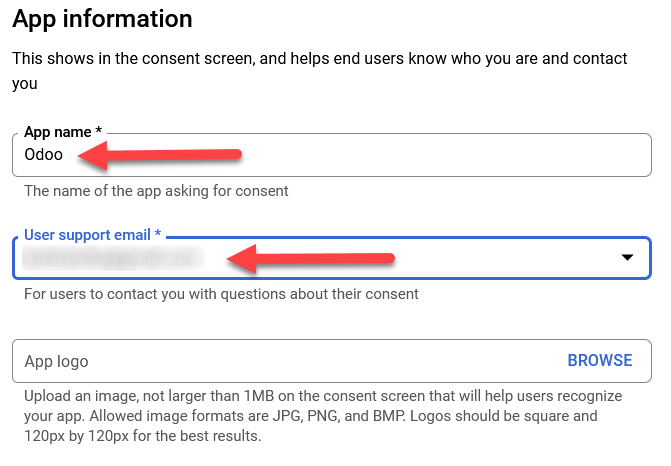
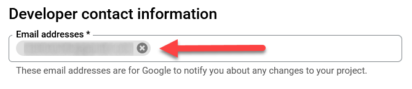
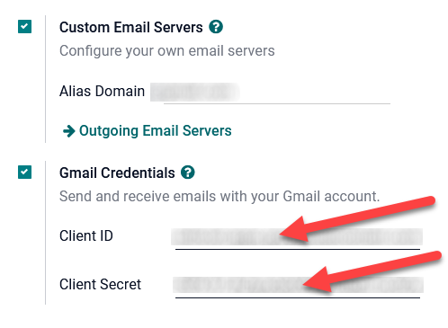
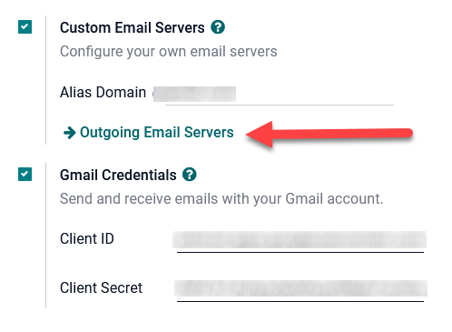
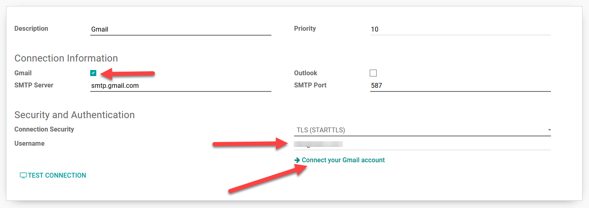
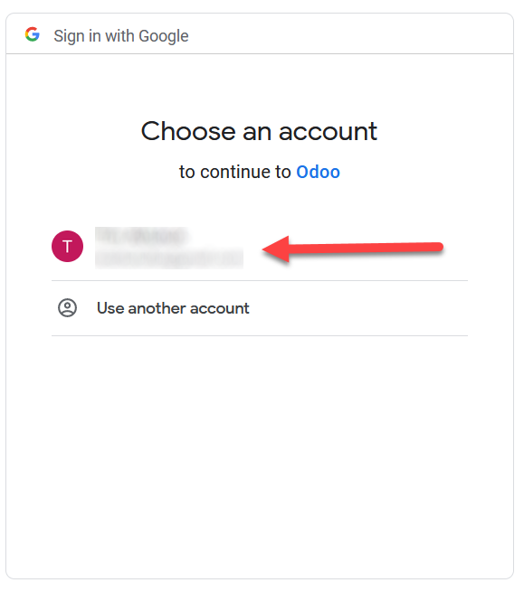
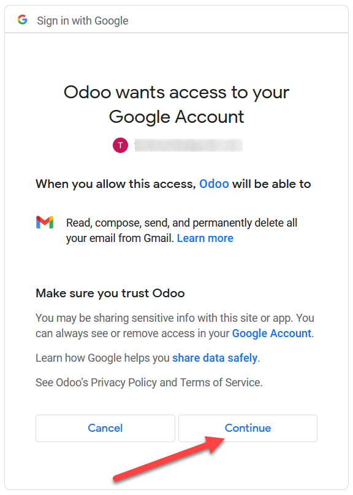
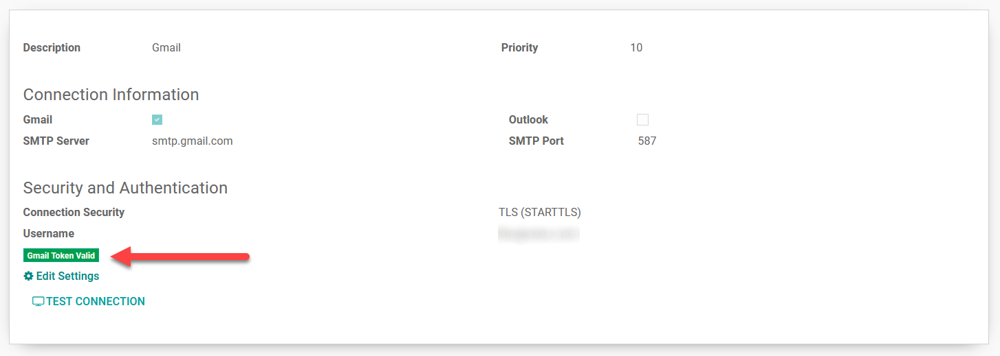
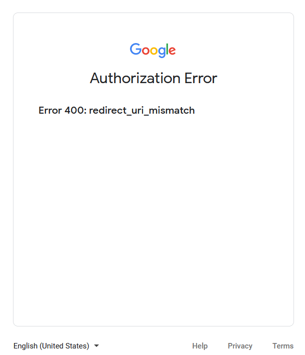

========================================
Setup Google Gmail using OAuth with Odoo
========================================

Odoo is compatible with Google's OAuth for Gmail. With only a few steps to set up on Google's
platform, and a few steps to configure in the Odoo database, sending emails securely from a custom
domain (on *Google Workspace*) to customers is easy! Here's `Google's documentation
<https://support.google.com/cloud/answer/6158849>`__ on setting up OAuth.

Setup in Google
===============

To get started, go to `Google APIs platform
<https://console.cloud.google.com/apis/credentials/consent>`__ to generate Google Gmail API
credentials. Log in with the *Google Workspace* account.

To the far right of the OAuth consent screen, click on *Create Project*. On the new project screen,
rename the *Project* to 'Odoo' and select the location as the *Google Workspace* organization.

.. note::
   If this is a *Personal Gmail Account*, then leave it as 'No Organization'.

.. image:: google_oauth/new-project.png
   :align: center
   :class: img-fluid

Next, click on *Create*, and then the *User Type* screen will appear. Select the radio button next
to *External* and click on *Create*.

.. image:: google_oauth/external-project.png
   :align: center
   :class: img-fluid

On the *Edit app registration* page, enter 'Odoo' in the *App name* field. Select the
organization's IT email address under the *User support email* field.

Scroll down on the *Edit app registration* page and click on *Add Domain* under the
*Authorized domains* section. Enter 'odoo.com'.

.. image:: google_oauth/auth-domain-odoo.png
   :align: center
   :class: img-fluid

Under the *Developer contact information* section, enter the organization's IT email address.

Next, click on the *Save and Continue* button. On the *Scopes* page, there is no need to add any
scopes. Scroll to the bottom and click on the *Save and Continue* button. On the *Test users* page,
there is no need to add any users. Click on the *Save and Continue* button. A summary of the
*App registration* will appear. Scroll to the bottom and click on *Back to Dashboard*. Click on
*Credentials* in the left sidebar to create the **Client ID** and **Client Secret**.

.. image:: google_oauth/app-credentials.png
   :align: center
   :class: img-fluid

Click on *Create Credentials* in the top menu and then select *OAuth client ID* from the dropdown
menu.

.. image:: google_oauth/create-credentials.png
   :align: center
   :class: img-fluid

Under *Application* Type, select *Web Application* from the dropdown menu.

.. image:: google_oauth/web-application.png
   :align: center
   :class: img-fluid

Name the *Client ID* 'Odoo' and under *Authorized redirect URIs*, click the button '*ADD URI*': 
https://yourdbname.odoo.com/google_gmail/confirm

.. note::
   Replace 'yourdbname' in the URL with the Odoo database name.

.. image:: google_oauth/add-uri.png
   :align: center
   :class: img-fluid

Click on *Create* and an OAuth **Client ID** and **Client Secret** will be generated. Copy each to
a Notepad and navigate to the **Odoo** database for the completion of the configuration.

.. image:: google_oauth/client-credentials.png
   :align: center
   :class: img-fluid

Setup in Odoo
=============

Navigate to the **Apps App** from the home screen on the database, remove the *Apps* filter, and
type in 'Google'. Install the module called **Google Gmail**.

.. image:: google_oauth/gmail-module.png
   :align: center
   :class: img-fluid

Navigate to the **Settings App ‣ General Settings** and under the **Discuss** section, ensure that
the checkbox for *Custom Email Servers* is checked. This populates a new option for
*Gmail Credentials*. Copy and paste the **Client ID** and **Client Secret** into the respective
fields and *Save* the settings.

On the **General Settings** page under *Custom Email Servers*, click *Outgoing Email Servers* to
configure the external Gmail account.

Create a new email server and check the box for *Gmail*. Fill in the *Description* and *Username*
and click on *Connect your Gmail account*.

A window from **Google** will appear to complete the authorization process. Select the appropriate
email address that is being configured in Odoo.

Click *Continue* to allow the exception and proceed to the next step.

.. image:: google_oauth/google-unverified.png
   :align: center
   :class: img-fluid

.. note::
   This step will only appear if *No Organization* was chosen for the *Location* when
   creating the project on the OAuth consent screen. This indicates a *Personal Gmail Account*
   rather than *Google Workspace*.

Allow Odoo to access the Google Account by clicking on *Continue* or *Allow*.

The configuration will automatically load the token in Odoo, and a graphic stating *Gmail Token
Valid* will appear in green.

Save the settings and *Test the Connection*.

The Google Gmail account is now functioning in Odoo using OAuth to authenticate. The database is
now sending safe, secure emails through Google using Oauth authentication.

Google OAuth FAQ
================

**Production** VS **Testing** *Publishing Status*
-------------------------------------------------

Choosing *Production* as the *Publishing Status* (instead of *Testing*) will display the following
warning message:

.. warning::
   OAuth is limited to 100 sensitive scope logins until the OAuth consent screen is verified. This
   may require a verification process that can take several days.

To correct this warning, navigate to the `Google APIs platform
<https://console.cloud.google.com/apis/credentials/consent>`__. If in *Production*, then click
*Back to Testing* to correct the issue.

.. image:: google_oauth/back-to-testing.png
   :align: center
   :class: img-fluid

**Desktop App** VS **Web Application** *Application Type*
---------------------------------------------------------

Should *Desktop App* under the *Application Type* be selected when creating the *Credentials (OAuth
client ID)*, the following error message will display:

To correct this error, delete the credentials already created and create new credentials using the
*'Web Application' Application Type*.

.. image:: google_oauth/web-application.png
   :align: center
   :class: img-fluid

Under *Authorized redirect URIs*,  ADD URI: https://yourdbname.odoo.com/google_gmail/confirm

.. note::
   Replace “yourdbname” in the URL with the Odoo database name.

.. note::
   `Google’s documentation <https://support.google.com/cloud/answer/6158849#zippy=%2Cnative-applica
   tions%2Cweb-applications>`__ on Web applications vs. Native applications.