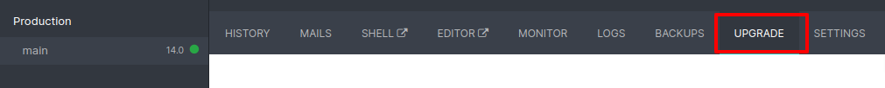
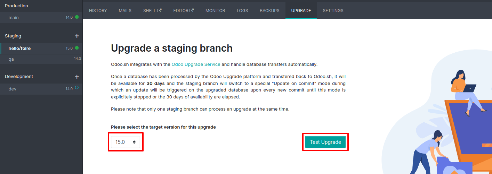
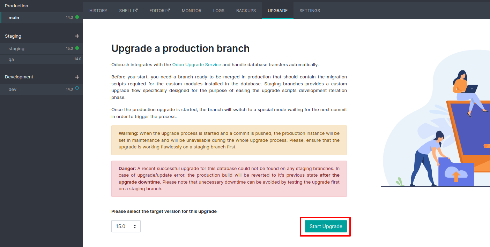
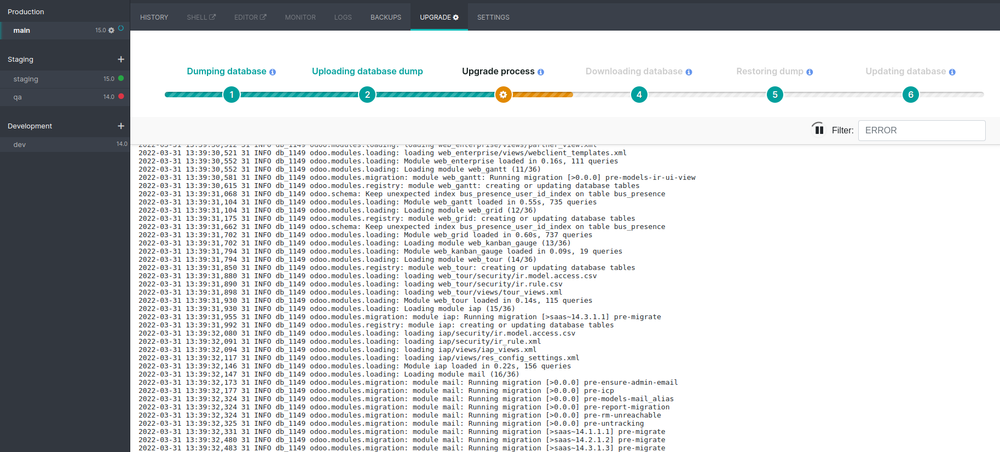

.. _odoo_sh_upgrade:

=======
Odoo.sh
=======

.. _odoo_sh_upgrade/overview:

Overview
========

Odoo.sh is integrated with the upgrade platform. A testing phase can be done on a staging branch
allowing to upgrade the latest backup.
The upgrade menu is available in the branches menu for valid projects with a valid production build.

The suggested upgrade steps on Odoo.sh are:

* On a development branch: update your custom code to keep them compatible with the new version and thoroughly test it.
* Switch that branch to staging, upgrade the last daily production backup and test it. Add upgrade scripts if necessary.
* Trigger the production upgrade and sit tight.

.. _odoo_sh_upgrade/custom-modules:

Custom modules
==============

Your custom modules also need to be upgraded to keep them compatible with the new version.
Change the odoo version in the development branch settings to the new version.
Update your code to match the new version.

Depending on your contract, the upgrade of your custom modules can be done
- by yourself
- by your Partner
- by Odoo (if you hold a subscription including 'Maintenance of Customizations')

.. _odoo_sh_upgrade/testing-phase:

Testing Phase (staging branch)
==============================

Create a staging branch that will run the upgraded database.
Either make sure your production branch's code is
compatible between the two Odoo versions and fork your production branch,
or make a new staging branch containing
the upgraded code.

This phase allows to upgrade a backup. When the upgrade starts, the **latest production
daily automatic backup** will be picked.
The backup will be sent to the upgrade platform to start the upgrade process.
In this phase, the upgrade process will be a test upgrade.
Its progress will be available in the upgrade menu of the branch on Odoo.sh.

When the upgraded backup is ready on the upgrade platform, it will be downloaded on Odoo.sh.
The branch will be in a special mode.
Each time a **commit is pushed** on the branch, a **restore** of the upgraded backup will occur,
and an **update of all the custom modules** will be happen.
Allowing you to quickly iterate on your custom modules upgrade scripts.
The upgrade.log log file within your newly upgraded staging build will contain the whole process.

Test the upgraded database and make sure everything runs as it's supposed to.
Once you are satisfied wth the results, close the upgrade process.

The upgrade mode will be automatically closed after 30 days.

Production
==========

Once you've tested everything and you're satisfied,
start the process on the production branch.

The actual process will be **triggered as soon as you push a new commit** in your branch.
Make sure you are pushing code that is compatible with the new version.
For example by merging the code from your upgraded staging branch.

The progress of the upgrade will be available in the upgrade menu of your production branch.

Your database will be unavailable throughout the process.

If anything goes wrong, the platform will automatically revert the upgrade same as for an update.
The platform will always make one before you make any
Odoo.sh operation on the production database. If the restored backup comes from a previous version, the platform will
detect it and change the project's Odoo version back if it needs to.
The update of your custom modules need to be successfull to go through with the full upgrade process,
make sure the state of your staging upgrade is successfull before trying on production.

Removing unnecessary modules
============================

It may happen that custom modules are not necessary anymore after an upgrade.
Custom modules in the upgraded database are set to be updated.
If the modules are missing in the code, the update will fail, thus failing the whole process.
An empty module with a manifest and possibly some custom upgrade script are necessary to clean up the database.
The complete removal of the module has to be handled afterwards.
