=====
India
=====

Introduction
============

The Indian localization has been improved and extended in Odoo v15. In this version, the next modules are available:

- **l10n_in:** Adds accounting features for the Indian localization, which represent the minimal
  configuration required for a company to operate in India. The main elements included in this module are two formats of Chart of Accounts i.e Indian Chart Of Accounts - Standard and Indian Chart Of Accounts - Schedule VI.

- **l10n_in_edi:** Includes all technical and functional requirements to submit invoicing
  through API to the government.

Configuration
=============

Install the Indian localization modules
----------------------------------------

For this, go to *Apps* and search for ``l10n_in``. Then click *Install* in the module **Indian - E-invoicing**. This module has a dependency with **Indian - Accounting**. In case this last
one is not installed, Odoo installs it automatically with E-invoicing.

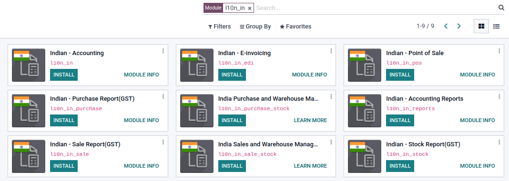

.. note::
   When you install a database from scratch selecting India as country, Odoo will automatically install the base module: Indian - Accounting.

Setup E-invoice Service
------------------------

Once the modules are installed, to be able to start the service,
it’s necessary to set the username and password for the company.

Go to :menuselection:`Accounting --> Configuration --> Settings` and
look for the *Indian Electronic Invoicing* section.

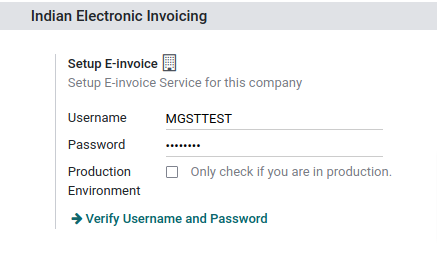

.. note::
   For the creation of an API username and password please refer to this document:
   https://service.odoo.co.in/einvoice_create_api_user

Journal Configuration
----------------------

To configure you journals go to :menuselection:`Accounting --> Configuration --> Journals`:

Open your sales journal. Under the Advanced Settings tab, in the *Electronic invoicing* field, check E-Invoice (IN) and Save. By default, it is *Checked* for sales journals.

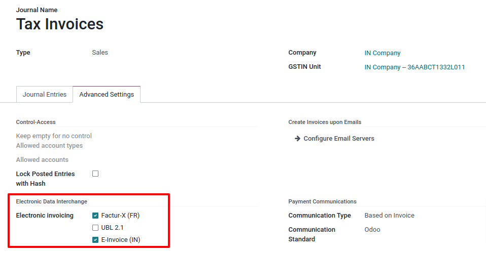

Workflows
=========

Electronic invoicing
--------------------

To start invoicing from Odoo, an invoice must be created using the standard invoicing flow.
That is either from a sales order or an invoice menu in the Accounting application.

The invoice will be posted after clicking on *Confirm*, before that the status is still in draft
mode and changes can be made to it. After validating the invoice, you can verify that it was
successfully posted, as it would look like this:

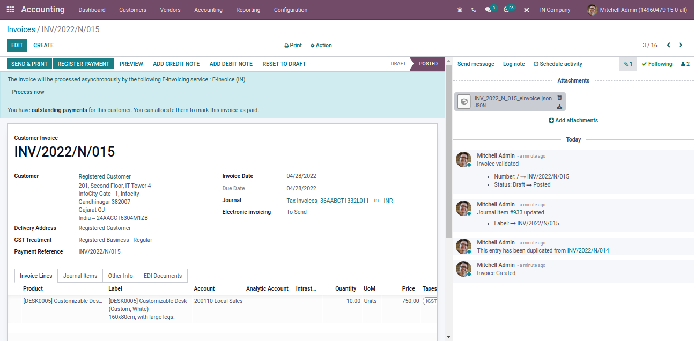

.. tip::
   Depending on the size of the screen, the Chatter can be seen next to or below the document.

Invoice validation
------------------

Once the invoice is following message is displayed at the top of the invoice:

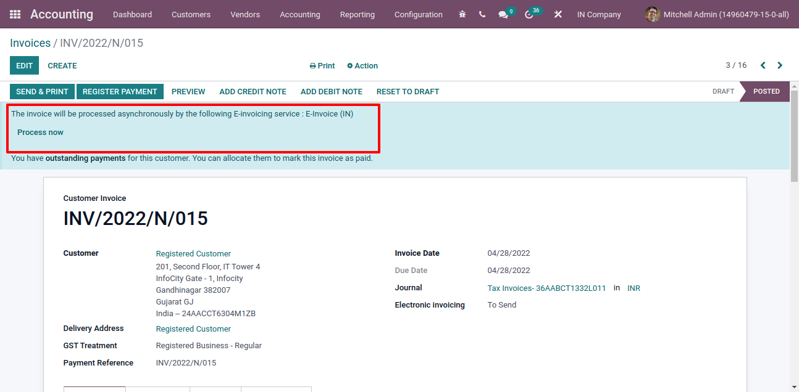

Odoo will automatically submit the JSON Signed file to the government portal. But if you want to submit the invoice immediately, then you can process it by clicking on ``Process Now``.

.. tip::
   You can find the JSON Signed file in the attachment.

Electronic Invoice Status
-------------------------

You can check the current status of your customer invoice under the Electronic invoicing field EDI Document tab in an invoice.

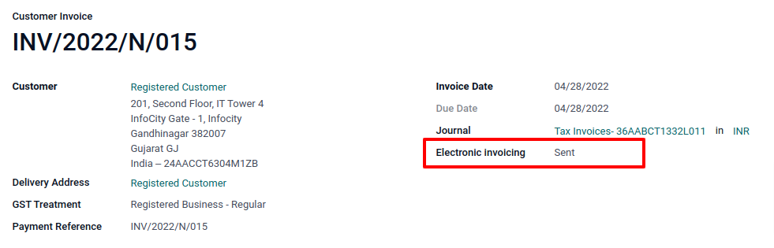

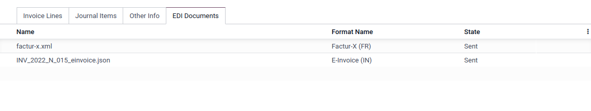

Invoice PDF Report
------------------

After the invoice is submitted and validated, the invoice PDF report can be printed. The report includes IRN, acknowledgment number and date, and QR code, indicating the invoice is a valid fiscal document.

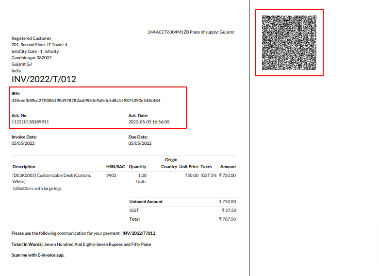

EDI Cancellation
----------------

To cancel E-invoice set cancel reason and remarks at *Other info* tab in invoice.

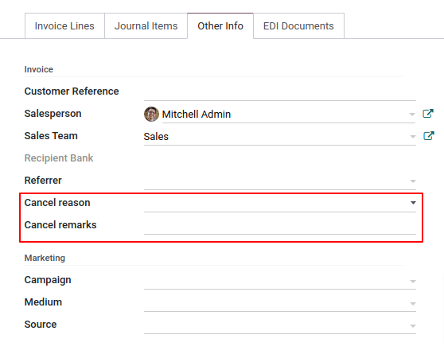

After clicking on **Request EDI cancellation**, the status of the **Electronic invoicing** field
will be *To Cancel*.

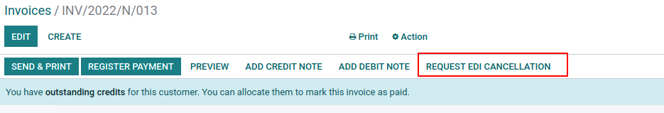

.. note::
   If you want to abort cancellation before processing the invoice, then click on *Call Off EDI Cancellation*

Once you request for canceling the e-invoice odoo will automatically submit the JSON Signed file to the government portal. But if you want to submit it immediately, then you can process it by clicking on ``Process Now``. The status of the **Electronic invoicing** field will be *Cancelled*.

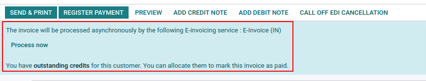

.. tip::
   You can find the JSON Signed file in the attachment.

Verify E-invoice
================

After submitting E-invoice, you can also verify the signed invoice from the government portal.

#. Download the json file from the attachment.

   .. image:: media/india_edi_12.png
      :align: center
      :alt: json file from the attachment

#. Open E-invoice portal: https://einvoice1.gst.gov.in/
   go to :menuselection:`Search --> Verify Signed Invoice`

   .. image:: media/india_edi_13.png
      :align: center
      :alt: open E-invoice portal

#. Browse json file and submit

   .. image:: media/india_edi_14.png
      :align: center
      :alt: open E-invoice portal

#. you can check verified signed E-invoice here

   .. image:: media/india_edi_15.png
      :align: center
      :alt: verified e-invoice