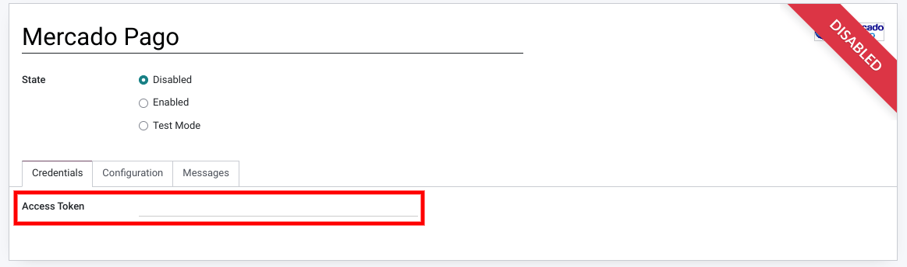
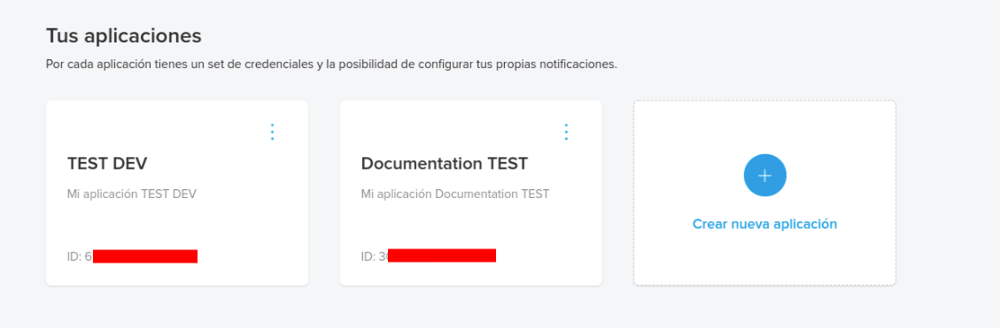
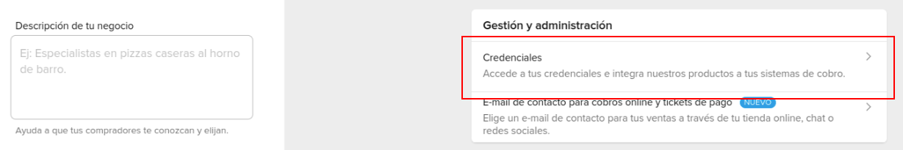
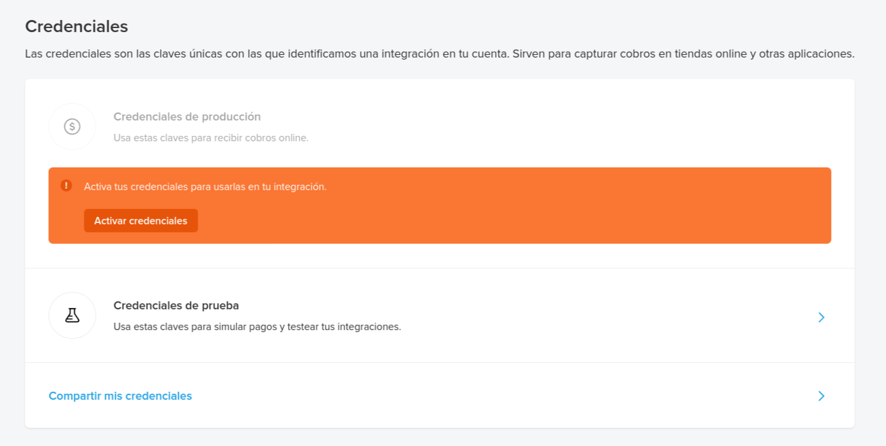

============
Mercado Pago
============

`Mercado Pago <https://www.mercadopago.com/>`_ is a digital payment platform available to consumers
and businesses exclusively in Latin America.

Configuration
=============

.. seealso::
   - :ref:`payment_acquirers/add_new`

Credentials tab
---------------

Odoo needs an **Access Token** to connect with your Mercado Pago account.
An access token is linked to a specific *application* in Mercado Pago, if you do not have one you
must first *create one*.

.. important::
   If you are trying Mercado Pago as a test, with a *test account*, change the **State** to
   *Test Mode*. We recommend doing this on a test Odoo database, rather than on your main database.

Applications
~~~~~~~~~~~~

To create a new application go to the developers `portal <https://mercadopago.com/developers>`_.
and select
:menuselection:`You integrations --> Dashboard`.

During the creation in the *Select Product to Integrate* dialog box select *Checkout API*.
You can now manage your new application in the developers
`portal <https://mercadopago.com/developers>`_.

Access Token
~~~~~~~~~~~~~~~~~~~~~~

Your can find your *access token* in two ways:
    * in the developers portal by selection your application
    * in the settings of your account
      :menuselection:`Your Business  --> Configuration --> Credentials`.

On your credentials tab you can find your *Access Token*, copy it to your credentials tab in the
configuration of Mercado Pago in Odoo.

.. note::
   You can switch between applications by clicking on the arrow at the side of your application id.

.. important::
   Select production credentials if you are not using a test account, you **must** select test
   credentials if you are using a test account. We recommend doing tests on a test Odoo database,
   rather than on your main database.
