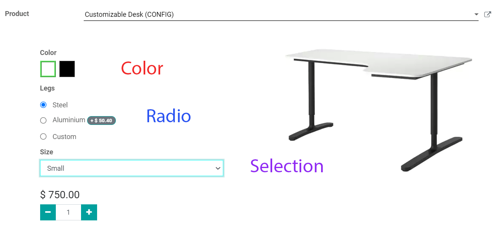
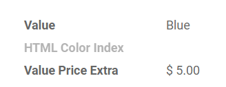

================
Product variants
================

Product variants are used to give single products a variety of different characteristics, such as
size, color, etc. Products using variants can be managed at the template level, which applies to
all variations, and/or at the variant level, which applies only to specific attributes.

As an example, a company selling t-shirts may have the following product:

- T-shirt

  - Sizes: S, M, L, XL, XXL
  - Colors: Blue, Red, White, Black

In this example, the **T-Shirt** is the product template, and **T-Shirt, S, Blue** is a product
variant. Sizes and colors are the **attributes**.

The above example has a total of 20 different products (5 sizes x 4 colors). Each one of these
products has its own inventory, sales, etc.

Configuration
=============

Activating the variant feature
------------------------------

To use product variants, head over to the Sales app, select :menuselection:`Sales --> Configuration
--> Settings,` and enable the **Product Variants** feature.

.. image:: variants/activating-variants-setting.png
   :align: center
   :alt: Activating product variants

Creating attributes
-------------------

Attributes need to be created before product variants can be set up in your database. Attributes
can be accessed via :menuselection:`Configuration --> Attributes`. To create a new attribute,
click **Create**. First, choose an attribute name, such as “color” or “size.”

.. image:: variants/attribute-creation.png
   :align: center
   :alt: Attribute creation window

Then, select a display type from *Radio*, *Select*, and *Color*, which determines how your product
will be shown on your eCommerce page, PoS dashboard, and Product Configurator.

- *Radio*: Options are in a bullet style list
- *Select*: Creates a dropdown menu to select options.
- *Color*: Creates little squares to choose color options. The squares will reflect any HTML color
  codes set.

Selecting a *Variants Creation Mode* informs Odoo when a new variant needs to be created once an
attribute is added to a product. The available options are instantly, dynamically, or never.
Select *instantly* to create all possible variants as soon as an attribute and values are added
to a product. Choose *dynamically* for creating variants only when corresponding attributes and
values are added to a sales order. *Never* as a selection means that variants are never created
for a particular attribute.

.. note::
   Once added to a product, an attribute’s *Variants Creation Mode* cannot be edited.

Values should be added to an attribute before saving, but more values can be added at any time,
if needed. To add a value, click **Add a Line.** From there, you can:

#. Type in the value’s name.
#. Check whether or not the value is custom.
#. Specifically for colors, add an HTML color code to make it even easier for salespeople and
   customers to know what they’re selecting.

A color code can be selected by either dragging around the slider or entering a specific HTML
color code to ensure an exact product match whenever possible.

.. image:: variants/picking-a-color.png
   :align: center
   :alt: Selecting a color

.. tip::
   *Attributes* can also be created on the fly by adding a new line and typing the name into the
   *Variants* tab on a product.

A new tab appears on the attribute’s page called **Related Products** after an attribute is added
to a product. This tab lists every product in your database using the attribute.

Creating products with variants
-------------------------------

Head over to the **Products** page by clicking :menuselection:`Sales --> Products --> Products`, and
then, either select a product to add variants to or create a new one by tapping **Create**.

On the product page, a new tab called *Variants* has appeared. The smart button at the top of the
template indicates the number of currently configured variants on this product.

.. image:: variants/variant-smart-button.png
   :align: center
   :alt: Variants smart button

To add a new variant, click on the **Variants** tab, then on **Add Any Line** to add any attributes
and values to create new product options for your customers.

.. tip::
   The order of attributes on the *Attributes* page dictates how they appear on the Product
   Configurator, PoS dashboard or eCommerce pages.

Similar creation processes are accessible through the Purchase, Inventory, and eCommerce
applications.

Managing product exclusions
---------------------------

The examples below are all based on this product template that has two variant attributes :

-  T-Shirt

   -  Color: Red, Blue, White

   -  Size: S, M, L, XL, XXL

With the above product template, you have 15 different t-shirt products in three different colors
and five different sizes. If the red and blue t-shirts are the only shirts available in XXL, you can
deactivate the white variant.

Open :menuselection:`Sales --> Products` and select the product you want to edit. Click on the
**Configure Variants** button, select the line item for the White Color Attribute, and then click
on **Edit**. Click **Add a line** and select any product(s) and/or specific attribute values that
are incompatible with this color.

.. image:: variants/attributes-exclusions.png
   :align: center
   :alt: Excluding attributes

Setting a price per variant
---------------------------

Extra costs can be added to the main price for specific product variants.

To add an extra cost to a specific variant, open :menuselection:`Sales --> Products`, and click on
the product you want to modify. Click on **Configure Variants** to access the list of variant
values.

Click on the variant you wish to add a value to bring up the template and click **Edit**. In the
**Value Price Extra** field, type in the cost value for the particular variant that is added to the
original price.

When you have entered all the extra values you need, click on **Save**.

Impact of variants
==================

- **Barcode**: The code and barcode are associated with each variant instead of per template. Each
  individual variant can have its own unique barcode / SKU.

- **Price**: Every product variant has its own public price, which is the sum of the template
  price and any optional charges for particular variants. For example, a red shirt’s cost is $23
  because the shirt’s template price is $20 and an additional $3 for the red color variant.
  Pricelist rules can be defined to apply on the template or the variant pricing.

- **Inventory**: Inventory is managed based upon product variants. You don’t own just t-shirts,
  but instead, you own Red, Size Small T-shirts or Blue, Size Medium T-shirts. On the product
  template form, the inventory shows the sum of all variants, but the actual inventory is computed
  by individual variants.

- **Picture**: Every product variation can have its own specific picture.

Many fields belong specifically to the product template, so updating these fields automatically
updates every variant as well. Examples include Income Account and Taxes.