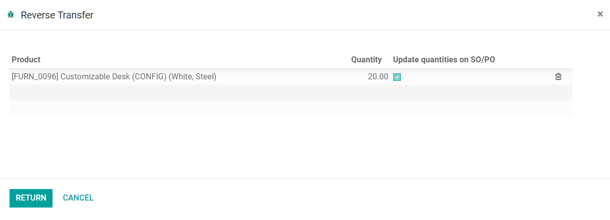
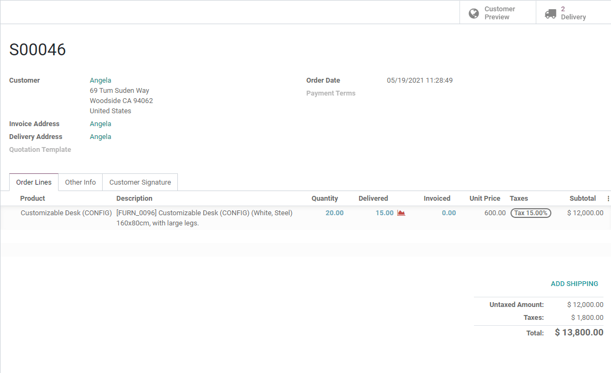
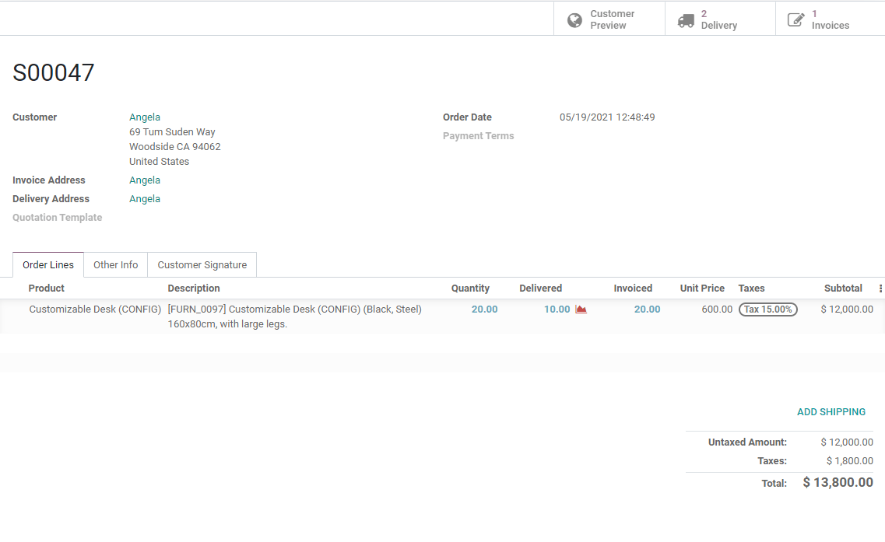
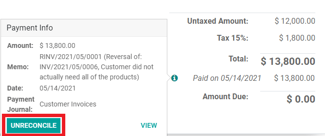
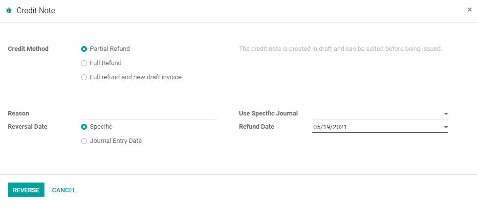
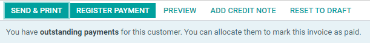

===================
Returns and Refunds
===================
Sometimes, customers are unsatisfied with the product they received and wish to return them. While
return reasons can vary between individual customers, ensuring your business has a comprehensive
return policy creates a smoother return process for both you and your customers.

The Sales App provides two different ways to process returns based on whether an invoice has been
sent or not.

Case 1: Using Reverse Transfers
===============================
When a customer decides to return a product before an invoice has been sent or validated, returns
are completed using reverse transfers.

To start a return, navigate to the customer’s Sales Order, and click on the Delivery smart tab to
open the associated Delivery Order. On the validated Delivery Order, the available buttons are
**Print**, **Return**, and **Unlock**.

Click **Return**, which opens the Reverse Transfer pop-up. By default, the quantities match the
validated quantities from the Delivery Order. Update the quantities if the customer wants to
return a portion of the validated amount. Clicking the trash icon next to a line item removes the
item without having to zero out the quantity.

Clicking **Return** generates a new Warehouse Operation for the incoming returned product(s). After
the receiving the return, the team can validate the Warehouse Operation. Head back to the original
Sales Order, and the Delivered Quantity reflects the difference between the original and the
returned quantities.

The customer receives an invoice only for the products they're keeping.

Case 2: Returning products after invoicing
==========================================
Sometimes, customers receive and/or pay their invoice before deciding to return an item within your
company’s return window. In these cases, a return using only Reverse Transfers is impossible since
validated or sent invoice cannot be changed, but Reverse Transfers can be used in conjunction with
Credit Notes to complete the customer's return.

Navigate to the customer’s Sales Order. If a Sales Order has any registered payment on it, the
payment details are located in the chatter, and the invoice itself has a **Paid** banner across it.

A customer wants to return 10 of the 20 products that they purchased, already paid for, and
received. Starting a return in this case begins the same as Case 1 by clicking on the validated
Delivery Order, then on  **Return** to open the Reverse Transfer pop-up. Edit the quantity from 20
to 10 since the customer only wants to return half of the order, and click **Return**. Just as in
Case 1, this action generates a new Warehouse Operation for the incoming returned product, which can
then be validated once received. Back on the Sales Order, if **Update Quantities** was selected, the
return product's line item now reflects the change in amount under delivered quantities.

Since the items have already been paid for, the validated invoice needs to be changed to reflect
that your team processed a return. Tap on the **i** icon next to the paid line item, and the
**Payment Info** pop-up appears and provides the option to unreconcile this payment. Click on
**Unreconcile**.

After the invoice is unreconciled, the options for **Send & Print** and **Register Payment** become
available again alongside a note that there are outstanding payments for the customer.

.. note::
  The Accounting application needs to be installed for the **Unreconcile** option to be available on
  an invoice.

Now, select **Add Credit Note**, and a pop-up menu appears where several selections need to be made.

Choose whether you want the Credit Method to be issued as a Partial Refund, Full Refund, or a Full
Refund and new draft invoice. A reason for the credit is not required, but adding one can ensure
team members know exactly why a customer was credited if looking at orders later. Choosing a
Specific Reversal Date requires a **Refund Date** to also be selected. For both options, a
**Specific Journal** is not required but can be a helpful tool for team organization.

.. tip::
  Choosing **Full Refund and New Draft Invoice** cancels the created invoice and creates a new draft
  one.

After clicking **Return,** edit the quantity of the product on the draft invoice before confirming
the invoice. A new banner appears after confirmation to inform your team that this particular
customer has outstanding payments that can be used as a payment option on the invoice. Odoo will
display this message until the credits are completely used on their account.

