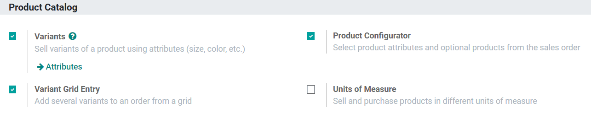
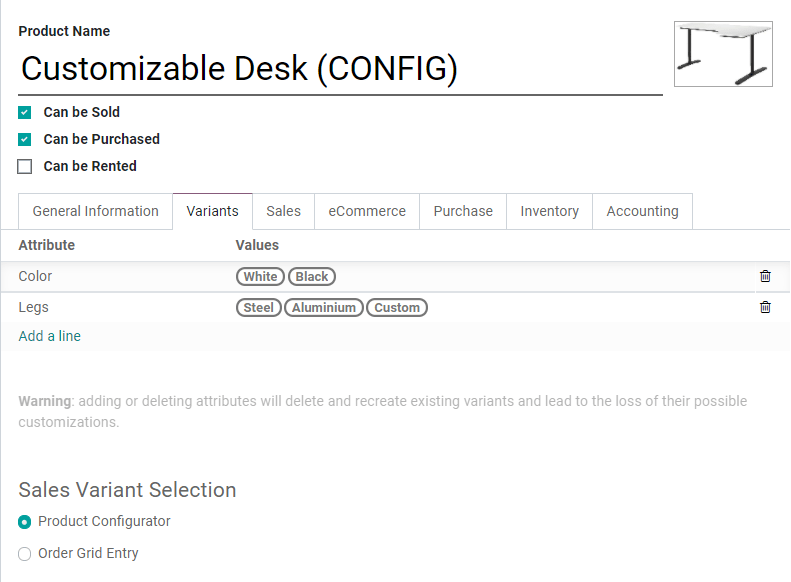

=========================================
Product variants on quotations and orders
=========================================

You can utilize the Product Configurator, Variant Grid, or both to add product variants to
quotations and Sales Orders depending on the situation.

Configuration
=============

Before using product variants on your quotations and Sales Orders, you first need to activate one or
both settings. To do so, head to :menuselection:`Sales --> Configuration --> Settings`, and activate
the **Product Configurator** and **Variant Grid Entry** options respectively.

Head over to any product template by selecting :menuselection:`Sales --> Products --> Products`.
Choose any product or create a new one by clicking on **Create**. Once on a product template, click
on the **Variants** tab, then on **Add Any Line** to add any attributes and values to create new
product variants. Before saving, select either the Product Configurator or the Order Grid Entry as
your option for *Sales Variant Selection*.

.. tip::
   Only one type of variant selection option can be active on a single product template at a time.
   They can be edited at any time.

Using the Product Configurator
==============================

When activated, the Product Configurator appears on a quotation or Sales Order when products are
added that have both Variants configured and the Product Configurator option selected.

Create a quotation and add a product with the Configurator enabled. Immediately, the Product
Configurator pops up on screen, and you and your salespeople can choose from available options
similar to what you’d see when online shopping. Color options display any HTML color codes set-up in
the color attribute. Attributes with a price extra added will display the extra amount next to their
name, such as **Aluminium** in the example below.

.. image:: orders_and_variants/configurator-price-extras.png
   :align: center
   :alt: Product Configurator and Price Extras

After confirming a selection, the name of the product is followed by the chosen variants in
parentheses as part of the product description, but they can also be shown if product variants are
checked in the additional options menu (3 vertical dots icon).

.. image:: orders_and_variants/variants-in-description.png
   :align: center
   :alt: Variants in order lines

Using Variant Grid Entries
==========================

Variant Grid Entries appear on a quotation or Sales Order after adding products configured with both
variants and **Order Grid Entry**. Grid Entry can streamline the process of entering large, varied
orders of a product through the ability to enter the exact quantities of every variation all at
once.

Create a quotation and add a product with Grid Entry enabled. The grid then pops up, and you and
your salespeople can select as many available variants and quantities as they want by either typing
in the number or using the arrows. *Not Available* is displayed when a combination isn't possible
and cannot have any quantities added.

.. image:: orders_and_variants/grid-entry-popup-amounts.png
   :align: center
   :alt: Variant Grid Entry Pop-Up

Confirming your selections adds each variation as individual line items to the quotation or Sales
Order. If, for example, the customer wants a small shirt in every available color, each shirt has
its own line item with individualized descriptions because each of these items has its own stock.

.. image:: orders_and_variants/grid-variants-line-items.png
   :align: center
   :alt: Line items for Grid Variants

