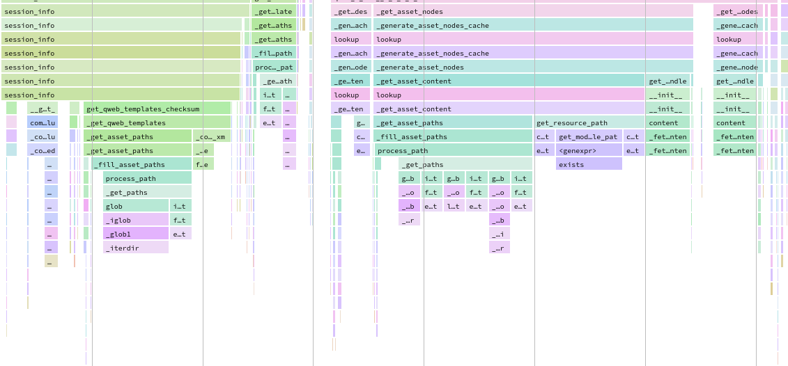
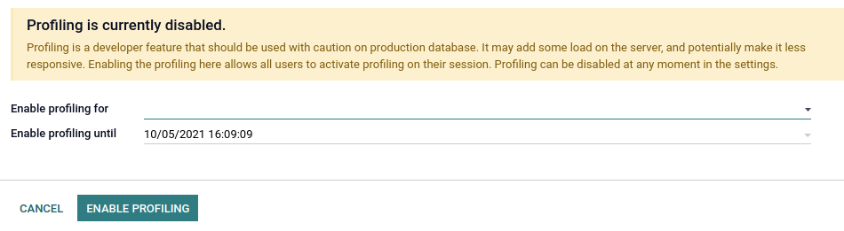
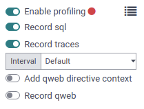
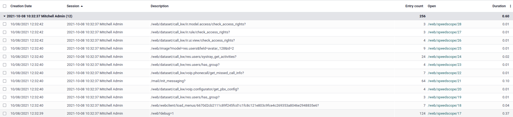
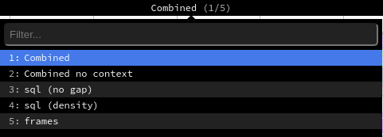

:custom-css: performance.css

=========================
Performance and profiling
=========================

How to make a piece of code run as fast as possible? This page will hopefully give tips and tools 
to achieve this goal.

Good practices
==============

Batch operation when you can
----------------------------

When working with recordset, it is (almost) always better to do operations in batch.

A typical mistake is execute sql in a loop, with a search for example.

.. rst-class::  bad-example
.. code-block:: python

    def _compute_count(self):
        for record in self:
            domain = [('related_id', '=', record.id)]
            record.count = other_model.search_count(domain)

This will perform an sql query for each record. In this kind of example, we can replace
`search_count` with a `read_group`.

.. rst-class::  good-example
.. code-block:: python

    def _compute_count(self):
        if self.ids:
            domain = [('related_id', 'in', self.ids)]
            counts_data = other_model.read_group(domain, ['related_id'], ['related_id'])
            mapped_data = {
                count['related_id'][0]: count['related_id_count'] for count in counts_data
            }
        else:
            mapped_data = {}
        for record in self:
            record.count = mapped_data.get(record.id, 0)

Trying to group sql queries will avoid the added cost of contacting the database and help postgresql
to optimise the query plan when possible.

.. warning:: Note that this example is not optimal/correct in all cases, it is only a substitute for
             a search_count. Another solution would be to prefetch and count the inverse One2many.
             There is no universal best solution.

Another example is the record creation.
The orm offers the possibility to create record in batch. This has no impact in
most cases but creating record in batch and keeping create override compatible
`api.model_create_multi` will help orm to optimize field computation, and give opportunity to
optimise create overrides in some cases.

.. code-block:: python

    create_values = []
    for name in ['foo', 'bar']:
        create_values.append({'name': name})
    records = model.create(create_values)

Another possible mistake is to miss the possible batch prefetching when reading on a single browsed
record inside a loop.

.. rst-class::  bad-example
.. code-block:: python

    for record_id in record_ids:
        model.browse(record_id)
        record.foo  # this will trigger one query per record_id

.. rst-class::  good-example
.. code-block:: python

    records = model.browse(record_ids)
    for record in records:
        record.foo  # this will trigger one query for all record_ids

In this last example the `prefetch_ids` of the recordset will show that each `record_id` is part of
`record_ids`, and thus they will be managed togethers. When reading the first record, the orm will
prefetch all record at once. In the rare cases where browsing all records together is unpractical,
the with_prefetch method can help to achieve the same goal.

.. code-block:: python

    for values in values_list:
        message = self.browse(values['id']).with_prefetch(self.ids)

Algorithmic complexity (basics)
-------------------------------

    Algorithmic complexity is a measure of how long an algorithm would take to complete given an
    input of size n

In some cases the straightforward algorithm will imply two nested loops. It can be justified in some
cases but it should be thought twice. In some cases it can be avoided by preparing data the right
way.

.. rst-class::  bad-example
.. code-block:: python

    for record in self:
        for result in results:
            if results['id'] == record.id:
                record.foo = results['foo']
                break
        else:
            record.foo = 0  # default value

This simple (an naive) example is # O(n²) and can be optimized by preparing data in a dict.

Assuming that all result have a different id:

.. rst-class::  good-example
.. code-block:: python

    mapped_result = {result['id']: result for result in results}
    for record in self:
        record.foo = results.get(record.id)['foo']

This kind of changes is not always as obvious as this one, it sometimes needs some thought.

Correct usage of data structures is important too. In the last example using a dict will allow
accessing an element in O(1), but sometimes quadratic complexity can be hidden.

.. rst-class::  bad-example
.. code-block:: python

    invalid_ids = self.search(domain).ids
    for record in self:
        if record.id in invalid_ids:
            ...

If invalid_ids is a list like the result of a search, the complexity may be quadratic. In this cases
we will prefer set operations, like casting `invalid_ids` in a set.

Depending on your input, you can either cast the list into a set outside of the loop, or prefer
recordset operations.

.. rst-class::  good-example
.. code-block:: python

    invalid_ids = self.search(domain)
    for record in self - invalid_ids:
        ...

or

.. rst-class::  good-example
.. code-block:: python

    invalid_ids = set(invalid_ids)
    for record in self:
        if record.id in invalid_ids:
            ...

Index critical column
---------------------
If your code perform search on some criteria or if the user will need to search on a field, it may
be a good idea to index the column.

.. code-block:: python

    name = fields.Char(string="Name", index=True)

But be careful to not index everything, index consume space and have performances drawback on
`INSERT`, `UPDATE` and `DELETE`.

Profiling
=========

The first step when trying to optimize some flow is to understand where the code spends time.

Odoo provides integrated profiling tools, allowing to save all executed queries and/or stack_traces
during execution.

Profiling tools can either be used to profile all request made to the server for a specific user
session, or be used manually by a developer to profile some part of the code.

In both cases, different collectors are available. A :ref:`collector <performances/collectors>` 
is specialized  to collect some piece of information in a standard format (sql, traces, ...) 
and for some of them, custom :ref:`execution context <performances/execution_context>` can be added 
by the developers to create virtual level of stack and add extra info.

Even if the profiling tools are think to be as light as possible, they still can have impact on
performance and must be used wisely, and result must me interpreted carefully.

Results can either be analyzed with custom tools (saved as json in a file or in database) or
inspected with the integrated SpeedScope view.

Profiling requests from the user interface
------------------------------------------

This is the easier way to profile in odoo but is only focus on web flows since only requests can be
profiled this way.

The first thing to know is that enabling profiling on a request may impact server load since each
request will have extra work processing the profiler result and profiling results uses some storage.
This is why this option must be enabled in the database settings for a certain period of time.
When enabled on the database, all users can enable the profiler for their session.
Profiling will stay active on the session until explicitly disabled or if the limit set in the
database settings is reached. Saas instances cannot be profiled.

When logged as admin, trying to enable profiling on the session will show a wizard to help user
enabling profiling. This can also be done manually going in the settings in debug mode.

For production database, it is advised to choose the shorter period possible. Once it's done you all
session will be able to enable profiling.

Open the debug menu again and enable the profiling again.
Three :ref:`collector <performances/collectors>` are available:

- sql
- traces
- qweb.
 
SyncCollector is not available on purpose. By default, sql and periodic will be enabled. Beside the
collectors, two options are available:

- Interval: used by the periodic collector to define interval between two samples
- Add qweb directive context: adds execution context when entering/exiting qweb directive
  (useful for sql and traces collectors but adds an overhead to directives)

Disabling the sql collector will give result closer to an execution without profiling but the
executed queries wont be available. Keeping the two collectors is a good compromise but keep this
in mind while analyzing the results.

Once enabled, all requests to the server will be profiled and saved into an ir.profile entry,
grouped into the current profile session. Once finished, disable the profiling and access the result
using the top tight icon.

In this example we profiled the /web page will all related resources. From this list you can access
the speedscope results. `Speedscope <https://github.com/jlfwong/speedscope>` is an open source app
allowing to visualize flamegraph. Speedscope usage is outside of the scope of this tutorial but be
aware that a lot of tools are available: search, highlight of similar frames, zoom on frame,
timeline, left heavy and sandwich view, ....

Regarding the result generated by odoo, we can note that the top menu offers different view modes
depending on what was profiled. By default with both sql and traces:

- The combined view sill show sql queries and traces merged togethers
- The combined no context will show the same result but will ignore saved execution_context.
- The sql (no gap) view represent all sql queries as if they where executed after ache other,
  without any python logic. This is useful when optimizing sql only.
- The sql (density) view represent sql queries only, leaving gap between them. This can be useful to
  spot if sql or python is the problem, and also identify zones where a lot of small queries that
  could be batched are executed.
- The frames view displays the result of the Periodic collector only.

Using profiler in python code
-----------------------------

Using the profiler manually can be convenient to profile a specific method/part of the code.
This can be a test, a compute method, or the entire loading.
The profiler is a context manager with parameters defining what you want to record:

.. automodule:: odoo.tools.profiler
   :members: Profiler

Without any parameter, the Profiler will enable sql and traces and save profiles to the database,
as when using it from the backend.

It is possible to configure the profiler with the `collectors` parameter, a list of string and/or
:ref:`collector <performances/collectors>` objects.

.. code-block:: python

    with Profiler(collectors=['sql', PeriodicCollector(interval=0.1)]):
        ...

    with Profiler(collectors=['qweb']):
        ...

The db parameter is mainly useful in low level context where the database cannot be detected
automatically on the thread or to disable automatic database ir.profiler creation with `db=None`.

The profiler can automatically disable gc when used programmatically. This can be useful for long
execution where gc activation may randomly trigger, especially during external call like call to
`postgresql`, showing unexpectedly slow calls.

Profiling tests
^^^^^^^^^^^^^^^

A profiler profiler shortcut is available for test classes. All execution of a test_method will be
group under the same session, and profile will be named with regard to the test state. This is
especially useful when using the `@warmup` en `@users` decorators.

.. code-block:: python

    with self.profiler():
        with self.assertQueryCount(__system__=1211):
            ...

Note that in this example the profiler is outside of the assertQueryCount in order to catch queries
done when exiting the context manager (flush, ...)

Good to know
------------
- Be careful about randomness, multiple execution can lead to different results.
  Ex: A garbage collector triggering during execution.
- Be careful to blocking call. In some case external c_call may take some time before releasing the
  GIL, leading to unexpected long frames with the PeriodicCollector. This should be detected by the
  profiler and give a warning. It is possible to trigger the profiler manually before such a call if
  needed.
- Be aware of cache. Profiling before view/assets/... are in cache can give different result.
- Be aware of profiler overhead. Sql profiler overhead can be important when a lot of small queries
  are executed, as the qweb profiler for small directives. Profiler is great to spot a problem but
  disable the profiler to measure the real impact of a change.
- Profiling result can be memory intensive. In some cases (profiling an install, or a long request)
  it is possible that you may reach memory limit, especially when rendering the speedscope result
  leading to an error 500 when fetching results and a message saying "Unrecognized format". In this
  case you may need to start the server with an higher memory limit locally.
  `--limit-memory-hard $((8*1024**3))`

.. _performances/collectors:

Collectors
----------
There are currently 4 main collectors available:

SqlCollector
^^^^^^^^^^^^
(aka `sql`)
Sql collector will save all sql queries made to the database in the current thread (for all cursors)
as well as the stack trace. This is especially useful to debug query count or add information to the
AsyncCollector in the combined SpeedScope view. The overhead of the collector is added for each
query to the analysed thread, meaning that using this collectors on a lots of small queries may
impact execution time and other profilers.

PeriodicCollector
^^^^^^^^^^^^^^^^^
(aka `traces_async`)
This Collector run in a separate thread and will save the stack trace of the analysed thread every
interval. This is one of the best way to analyse performances, as it should have a very low impact
on execution. The frequency (defined by the interval parameter) must be choose wisely. To low and
you may lose information, to high and you may have memory issues for long request.
The default interval is 10ms.

SyncCollector
^^^^^^^^^^^^^
(aka `traces_sync`)
This collector saves the stack for every function call/return. It is useless for performances
analysis since the overhead of using it is high, but this can be useful to understand complex flows
and follow the execution of dome code, mainly for debugging.

QwebCollector
^^^^^^^^^^^^^
(aka `qweb`)
This collector is mainly useful to optimise views. It will save the python execution time and
queries of all directive. As for the sql collector, the overhead can be important when executing a
lot of small directives.
Qweb collectors result are a little different from other collectors in term of collected data, and
can be analysed from the `ir.profile` view form using a custom widget

It is also possible to create custom collectors as far as they respect the current collector api.

.. _performances/execution_context:

Execution context
-----------------
Stack traces can be useful to understand where the program was at some point but no information
about the state of the memory is available. This can be problematic when profiling code inside
loops where everything will look to be part of the same block of execution even if one iteration is
slower. When displayed with speedscope, execution context will appear like additional level in the
stack.

Execution context are dictionaries mapped to some level of the stack saved on the thread.
This allow to add information for collectors. An helper context manager is available for that:

.. code-block:: python

    for index, package in enumerate(graph, 1):
      with ExecutionContext(module_name = package.name):
        module_name = package.name

Small tips: use two space indentation to add debug context manager without altering the rest of the
code.

This example (in loading.py) will add the name of the currently installed/loaded module.

.. _reference/performances/populate:

Database population
===================

Odoo CLI offers a :ref:`database population<reference/cmdline/populate>` feature.

.. code-block:: console

    odoo-bin populate

Instead of the tedious manual, or programmatic, specification of test data,
one can use this feature to fill a database on demand with the desired number of test data.
This can be used to detect diverse bugs or performance issues in tested flows.

.. _reference/performances/populate/methods:

To specify this feature for a given model, the following methods and attributes can be defined.

.. currentmodule:: odoo.models

.. autoattribute:: Model._populate_sizes
.. autoattribute:: Model._populate_dependencies
.. automethod:: Model._populate
.. automethod:: Model._populate_factories

.. note::
   You have to define at least :meth:`~odoo.models.Model._populate` or
   :meth:`~odoo.models.Model._populate_factories`
   on the model to enable database population.

Example model
-------------

.. code-block:: python

    from odoo.tools import populate

    class CustomModel(models.Model)
        _inherit = "custom.some_model"
        _populate_sizes = {"small": 100, "medium": 2000, "large": 10000}
        _populate_dependencies = ["custom.some_other_model"]

        def _populate_factories(self):
            # Record ids of previously populated models are accessible in the registry
            some_other_ids = self.env.registry.populated_models["custom.some_other_model"]

            def get_some_field(values=None, random=None, **kwargs):
                """ Choose a value for some_field depending on other fields values.

                    :param dict values:
                    :param random: seeded :class:`random.Random` object
                """
                field_1 = values['field_1']
                if field_1 in [value2, value3]:
                    return random.choice(some_field_values)
                return False

            return [
                ("field_1", populate.randomize([value1, value2, value3])),
                ("field_2", populate.randomize([value_a, value_b], [0.5, 0.5])),
                ("some_other_id", populate.randomize(some_other_ids)),
                ("some_field", populate.compute(get_some_field, seed="some_field")),
                ('active', populate.cartesian([True, False])),
            ]

        def _populate(self, size):
            records = super()._populate(size)

            # If you want to update the generated records
            # E.g setting the parent-child relationships
            records.do_something()

            return records

Population tools
----------------

Multiple population tools are available to easily create
the needed data generators.

.. automodule:: odoo.tools.populate
   :members: cartesian, compute, constant, iterate, randint, randomize