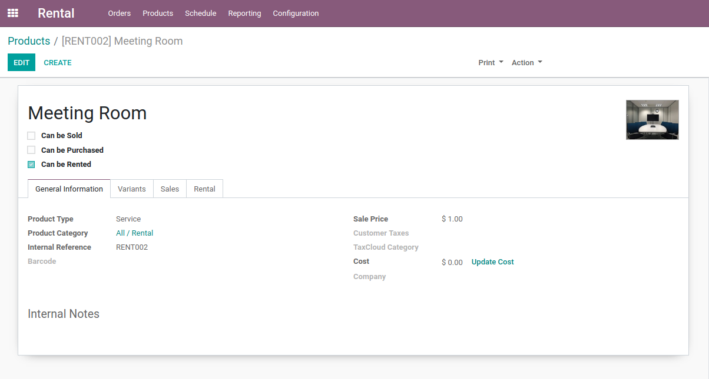
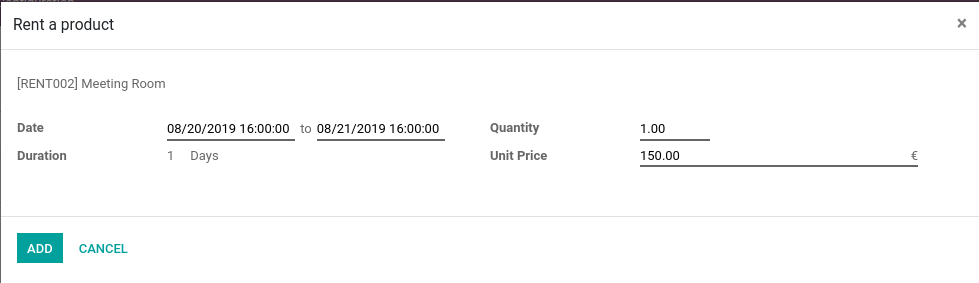

======================
How to rent a product?
======================

Product Configuration
=====================

To rent a product, all you need is to configure it as "Can be Rented".

Pricing
-------

In the rental tab of the product view, you can define rental-specific prices.  You specify a price and the duration for which it applies.

.. note:: By default, if no rental prices are defined on the product, its sales price will be used.  This means that if no rental prices are defined, the price of a rental will always be the same, whatever the duration !

.. note:: When pricelist are enabled (Sales application required), you can restrict a price to a given pricelist.  The restricted price won't be considered for rental orders using other pricelists.

The delay costs define the extra prices generated on late returns of the rented products.

.. note:: The delay price is computed precisely.
    E.g. 2 days and 1 hour of delay will be fined as 2*(Extra day price) + 1*(Extra hour price).

Inventory management
--------------------

When the Inventory application is installed, you may also specify a padding time on your product.  It is the estimated time you need to prepare the product between two reservations.
Know that this time is only informative.  If you specify it, you won't see the product as available for reservation when it is "in preparation", but you will still be able to deliver it.

Installing the Inventory app brings the ability to track products stock, and rent them in bulk or by unique items (serial numbers).

.. todo:: pricing heuristic only one rule can be applied at a time. --> done in reservation section ?

Reservation
===========

In the rental app, when a rental product is added to a rental order, a popup opens to specify the reservation period.
When the delivery and return dates are specified, the cheapest pricing rule is chosen and applied for the period.
The duration is displayed in the unit of measure of the best pricing found.

.. note:: The cheapest pricing rule means that if it is cheaper to rent the product for a month instead of 27 days,
    the price will be the price of a month, even if the period only covers 27 days !

.. warning:: Products are only reserved after the order confirmation (for the period between the delivery and the return dates).

Scheduling
----------

From the rental products or from the dedicated menu, you can access the Rental Schedule.  It shows the past and incoming reservations.
If a product is tracked by serial numbers, you can group reservations by serial numbers if you want a close up of a specific serial number availability.

Delivery and Return
===================

When an order is confirmed, you can at any moment deliver the rental products (and return any delivered ones).
It means that you may deliver products before their reserved period if you want but please remember that early deliveries
can conflict with other orders.

If you have the Inventory application, stock moves for delivery and returns are managed technically in the background, without pickings,
to ensure stock valuation stays correct (rented products are still your property).

Invoicing
=========

.. todo:: Ask FGI for subscription flow

.. todo:: FGI : Reporting, Maintenance
